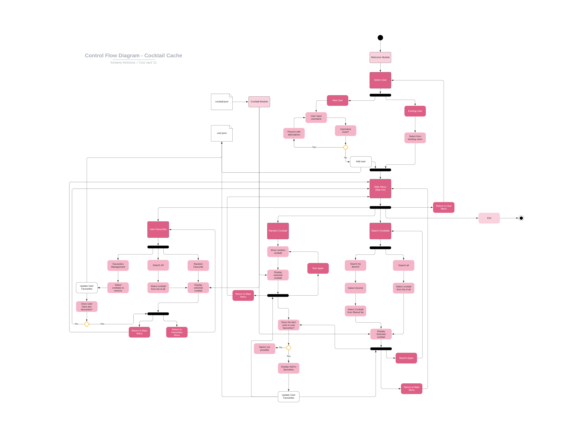

# Terminal Application
#### Kim McKenna

### Github Repository:
[GitHub - Cocktail Cache Terminal App](https://github.com/kimckenna/cocktail_cache) 

## PURPOSE AND SCOPE

### Intention

Sometimes making a decision is the hardest decision, and when it comes to cocktails that decision is made even harder when there’s a multitude of ways to make a drink depending on who you ask or google.
  
The thought process behind Cocktail Cache is to take the angst out of doing so by providing users with a cocktail at random or the ability to search a database of IBA official cocktails if they have a cocktail or a select ingredient in mind. The user is then provided with said cocktail ingredients and method of construction with the ability to add to favourites. 
 
Cocktail Cache uses cocktails from the IBA official list allowing users to first try some standardised classics.	

I felt there was a real gap in a very niche market for those who love cocktails and are nostalgic for the user interface of a terminal app. With this in mind I intend to keep the design simple, clean and functional; this little app once cloned and installed will store multiple users' favourites allowing each user to randomly select or view a cocktail from all cocktails or their favourites.
 
### Target Audience
 
The intended audience of Cocktail Cache is anyone who loves a cocktail and is looking to broaden their cocktail knowledge, try something new or revisit a favourite.
 
The ability to store multiple users' favourites makes this app perfect for those who enjoy a social drink with others; maybe one person wants their go-to cocktail, whilst someone else wants to be adventurous. This way they can both find what they’re after and reference it again if it goes down a treat.
 
### Present Use
 
Cocktail Cache was built with simplicity in mind.
After you've entered a new username or selected an existing, you're able to start exploring. Here on out all navigation is menu based and no written input is required.

Find a cocktail you'd love to save for later; add it to your favourites. 
Feeling adventurous and want to see what lady luck can offer; generate a random cocktail. 
Have a particular Aunt who loves Brandy; search by ingredient. 
 
Cocktail Cache; a curated app of cocktail classics. 

---

## FEATURES

The primary features of Cocktail Cache are:
 
1. Favourite a Cocktail
2. Request a Random Cocktail
3. Search for a Cocktail
 
These are made possible with the use of persistent storage through multiple json files that hold the database of cocktails and usernames with favourites selected by each user.
 
Each feature's objective is to provide an IBA Cocktail to the user; they all perform their function using a web of menus and what separates them is how they achieve this end objective.
 
### Favourite a Cocktail
 
*Create and manage your own list of favourite cocktails*
 
Whenever a user is presented with a cocktail they will have the ability to save it to a list of their own favourites. This will be tracked by having the user enter a username (new or existing) when they enter the app so they can reference the favourites at any point in their journey of the app. The users/ favourites functionality will use persistent storage to allow the user to revisit these favourites in a new session.
 
At a minimum the feature will allow the user to add a cocktail to favourites but ideally will have the ability to also remove the cocktail from favourites. 
 
### Request a Random Cocktail
 
*Select a cocktail at random; select from Cocktail Cache's full list or your own favourites* 
 
This feature I'm intending to keep quite simple. When a user generates a random cocktail at any available menu selection in the app, they'll be provided with a cocktail generated from a list of cocktails stored within persistent storage. I'm intending for this to be available on all cocktails and their favourites list.
 
The user will then be able to add to favourites list if it's not already favourited, or request another random cocktail.
 
### Search for a Cocktail
 
*Search the extensive list of cocktails by name or ingredient or explore your own favourites*
 
The user will be able to search a range of filtered lists of cocktails throughout the app. My intention at a minimum is to provide the ability to search all cocktails(separated by cocktail category) or search their favourites and ideally I want to provide the option to search based on alcohol type.
 
If the user's search is outside the favourites list and the cocktail isn't already favourited, they'll have the ability to add to favourites.
 
** Note: after commencing the build of the application I decided to forgo the categories search in lieu of a search all ‘by name’. The heart of the categories search was to show all cocktails and there wasn't a way to add a subheading whilst using TTY Prompt. As TTY Prompt was crucial in keeping consistency across my menu’s UI; the categories selection priority was downgraded and moved to backlog. The category identification code has been kept so this functionality could be added in the future.
 
---

## USER EXPERIENCE 

### User Interaction Plan 

After deciding on my core MVP features I realised the only point my app requires a user written input is when requesting a new user name be added and the remainder of my application could be run through an array of menus. Having seen TTY Prompt in use and knowing it's ability to remove user input altogether I plan to rely on this to reduce all error related to user input. 

All my features will pretty much interact in the same way, however they'll likely need different types of menus depending on what the feature performs. For example I know the search feature will display far more options and I'll need to work out a way to make this less overwhelming for a user then just showing a long list of endless options to chose from. 
Another consideration I need to have is to make all menu options self explanatory in what they will perform. E.g. if adding a New User it will be best for the menu option to say: 'Create New User' and if wanting to select from an existing user I'd be best using 'Existing User'. 

After planning the interaction of my features I know all features end objective is to provide a cocktail, as a result I know I need to create a secondary menu that at a minimum allows the user to add to favourites or return to main menu. There will likely be other points at which it's suitable to return to the main menu or alternative menus but i want to work this out after having built some of the app and see how it functions as I don't want every menu to provide an opportunity to exit the app or navigate away from the core features. 

Any additional errors I find during the build process or testing I want to present in a user friendly way that tells them what is happening if necessary but otherwise removes the possibility of the error all together. For example I know I need to find a way to tell the user a cocktail is already favourited if they try to add it again. In an ideal world the option won't present or will reflect as already favourited when the user views the cocktail; how this works will depend on my menu options and what I can code. 

Ultimately I don't want any user cases where the app has been stressed and responds with a Standard Error or produces a bug rather than an intended error message or continuation of the app flow with the user being none the wiser.  

### User Interaction Journey

After building some of my app and running testing I decided when entering Cocktail Cache greeting the user with a brief description of the application and it’s features would improve the user experience; helping provide the user with a quick explanation of the application before they start navigating their way through if they haven't read the README or app documentation. 

A small note is made to the menus advising a 'how to use' for each will be displayed to assist in navigation and how to look out for it. As intended in planning each menu option describes it's function allowing the user to easily navigate the app by following each menu option to the desired feature. Most pages allow for navigation back to the main menu and the main menu allows navigation back to the user menu so even if the user makes the wrong selection it’s simple enough to get to where they intended and selections that could lead to an error based on the users content have been disabled. 
 
In the instance the user has any troubles there is also a quick help guide which can be accessed through the command line and provides further detail into the set up and functionality of Cocktail Cache.
 
There is some functionality available when accessing Cocktail Cache through the command line arguments; these are listed within the help section and on the documentation README. The user is able to access all the core features and if not looking to save a cocktail to their favourites is able to view a cocktail within one argument with no additional navigation.

### Error Handling

As expected the majority of errors that could arise within this application are negated with the use of TTY Prompt. As a result the only written user input is the username when creating a new user. The username allows for any input so won’t throw an error if someone puts something with a weird format. A conditional has also been input if the user attempts to create a username that already exists. If this occurs the user is presented with an alternative and prompted to enter a new username again.
 
Error Handling has been implemented throughout Cocktail Cache to try catch potential errors that may arise. Extensive testing was taken to check the outputs of different use cases and as a result the following situations are now covered with conditionals in place. 
 
Users have the ability to clear/ delete all their favourites, this happens whilst they’re in the favourites section, as the functionality of the user section relies on a user having favourites the user is returned to the main menu if they complete this action. 
 
In line with this, new users or users with no favourites do not have the ability to access the favourites feature until they have at least one favourite. They are made aware of this with a disable message next to the Favourites menu option. 
 
As hoping for if a user displays a random cocktail or searches a cocktail that already exists within their favourite’s list they are provided a disable message on the Favourite Cocktail option to prevent duplicates within the Favourites. 
 
As the application relies on persistent storage; if the required files are not where they are expected on execution of the app, the user will be provided with a message directing them back to github to reclone the repository and a fix has been implemented if the user.json file is missing the empty hash so the error resolves and run without the user being advised. 

### User Testing 

User experience was kept in mind throughout the application build with different user journey's tested to find potential errors that could arise. 

Please refer to Error Testing for a snapshot of a test case.
 
---

## CONTROL FLOW DIAGRAM 

---

## IMPLEMENTATION 

[Trello Board - Cocktail Cache Terminal App](https://trello.com/b/izgiJ6wC/cocktail-terminal-app) 

Trello was used to create and manage the project flow of this terminal application and is the best way to ascertain the direction and execution of the build process.
 
### Initial Implementation Plan
 
The intended implementation of Cocktail Cache through Trello was as follows;
 
1. Create tasks in the backlog.
2. Code MVP features first.
3. If a bug arises and can be left until MVP works, create a card to fix the error later.
4. If a bug is preventing MVP element working; set as priority and fix.
5. When higher priority cards have been implemented, tested and moved to done; move the card that is naturally next priority based on current build progress to, To Do so can be looked at next.
6. Hold partially completed cards within Doing; if get stuck on one task try focusing on another, To Do by moving to Doing.
7. Once the build of the card is completed and the checklist covered, move to Testing then Done.
8. If bug arises but feature was previously completed, create new Bug card.
9. If additional functionality or code improvements are thought of during build; create cards in the backlog.
10. Only start Design Extras or Code Improvements once MVP and all known bugs impacting app have been dealt with.
11. Use App management for assignment requirements and app set up.
12. Assign time frame due date to card once moved to doing.
13. Try to implement expected time to complete the card based on expected length e.g. short task - no tag, medium task under 2hrs, long task over 2hrs. Adjust these as requirements.
14. Prioritise feature build based on knowledge and what has the biggest impact on other features.
 
As a result I chose to:
 
- Set up File structure
- Start on cocktail card formatting
- Build random function
- Build search function
- Build menus to connect features to primary rb doc and create flow of application
- Build Favourites function
- Build features secondary menus
- Build remove from favourites function
- Complete Error testing
- Add Design/ Usability extras or Code Improvements based on level of improvement to MVP

---

## ERROR TESTING 

 

